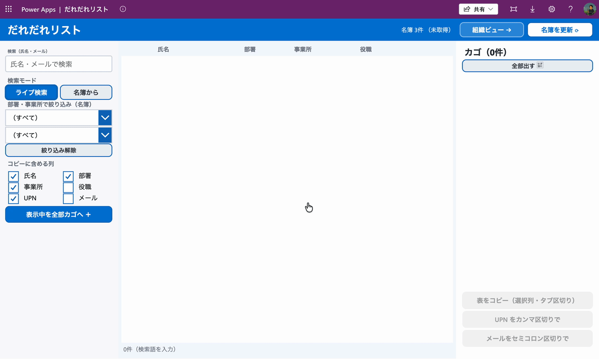

# だれだれリスト

社内のユーザー（Microsoft Entra ID）を検索して、必要な人を「カゴ」に入れ、**コピペできる形で書き出す**ためのキャンバスアプリです。

「権限を付与して欲しい人をまとめて相手に伝えたい。しかも相手が作業しやすいように、必要情報をまとめて送りたい！！」——そんな些細な業務を片付けます。

検索 → 一覧から選択 → **3つの形式でコピー**：

- 📋 **表（タブ区切り）** … 選んだ列だけ。Excel / Teams にそのまま貼ると表になります
- ✉️ **UPN をカンマ区切り** … `user1@…,user2@…` グループ指定やスクリプト用
- 📧 **メールをセミコロン区切り** … `user1@…;user2@…` Outlook の宛先欄用

## 📹 デモ



## 🆓 このアプリ自体が「無償ライセンスの範囲」で動きます

- **データソースは Office 365 ユーザー 標準コネクタのみ**（Dataverse も SharePoint も使っていません）
- プレミアムコネクタ・PCF コードコンポーネント不使用
- クリップボードへのコピーは Power Fx の `Copy()` 関数

## 🔒 データの扱い（最初に読んでください）

- 表示されるのは **組織のユーザー ディレクトリ情報**（氏名・部署・事業所・役職・メール・UPN・プロフィール写真）です。Office 365 ユーザー コネクタが、サインインしたユーザーの権限で組織のディレクトリを参照します。

## ✨ できること

- **氏名・メールでライブ検索**（Office 365 ユーザー コネクタの `SearchUserV2`）
- **行をタップして選択 → カゴへ**（プロフィール写真アバター付き／写真未設定の人は頭文字アイコン）
- **コピーする列を選べる**（氏名・部署・事業所・役職・UPN・メール）
- **名簿モード**：いったん全社員をローカルに読み込み、**部署・事業所・役職・氏名を「部分一致」で横断検索**＋ドロップダウン絞り込み
- **組織ビュー**：部署別／事業所別の人数ランキング。行をタップするとその所属で名簿を絞り込んで一覧へジャンプ

## ⚠️ 仕様上の制約（知っておくと迷いません）

Office 365 ユーザー 標準コネクタの仕様による制約です。

- **部署 / 事業所はサーバー側で検索できません。** 検索キーが効くのは氏名・メール・UPN だけ。だから部署・事業所での絞り込みは「**いったん名簿を読み込んでアプリ側で絞る**」方式（＝「名簿から」モード）になっています。
- **1回の取得は最大 999 件・ページング不可。** 名簿は a〜z / 0〜9 を巡回検索した和集合で集めています。**数千人規模のテナントでは一部取りこぼす可能性**があり、名簿モードは「ベストエフォート」です（氏名のライブ検索は常に確実）。
- **名簿キャッシュの永続化はモバイル/タブレットのプレイヤーアプリ専用。** Web ブラウザでの実行では保存されません（毎回「名簿を更新」を1回押す運用）。

## 📦 インポート方法

1. このリポジトリの `.msapp` ファイルをダウンロード
2. [make.powerapps.com](https://make.powerapps.com) → 左メニュー「アプリ」→「アプリのインポート」（または「新しいアプリ」→ キャンバス →「開く」から `.msapp` を指定）
3. 開いたら「名前を付けて保存」して自分の環境に保存

### 🔌 インポート後にやること（重要）

このアプリは **Office 365 ユーザー コネクタ** を使います。インポート後、データ接続を作り直す必要があります。

1. Power Apps Studio でアプリを開く
2. 左の **データ** パネル →「データの追加」→ **Office 365 ユーザー** を追加（職場アカウントでサインイン）
3. 数式エラーが出る場合は、データソース名がアプリ内の参照と一致しているか確認（日本語環境では名前空間が **`Office365ユーザー`** になります。英語環境では `Office365Users`。環境に合わせて参照名を読み替えてください）
4. 保存・公開

## 📁 リポジトリ構成

```
├── README.md
├── LICENSE              ← MIT
├── .gitignore
├── *.msapp              ← インポート用パッケージ（Power Apps からダウンロードして配置）
├── assets/
    └── demo.gif         ← README に表示するデモ GIF

```

## ライセンス

[MIT License](./LICENSE)

---
